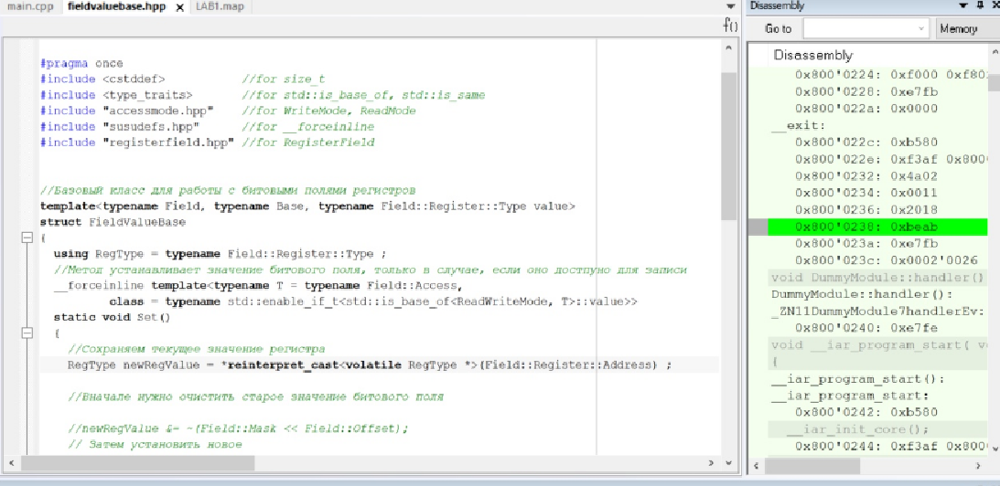

=== *Лабораторная работа №1*

Первым делом был создан файл main.cpp. Далее подключен к проекту файл cstartup.cpp
Созданы папки _AbstractHardware/Registers/FiledValues, Common_. Создана структура проекта в соотвествии со структурой папок

.Структура программы
image::Photooo/structura.png[]
Настроены STACK, HEAP.

.Установка значений CSTACK, HEAP
image::Photooo/stack and heap.png[]

Далее было скопировано содержимое папки из папки _AHardware/Registers_ и _Common_ с проекта преподавателя в свою папку.
А также написан код программы в main.cpp.

.Код программы
image::Photooo/cod programms.png[]

При первой попытке откомпилировать и отлинковать программу произошла ошибка.

.Первая ошибка
image::Photooo/first error.png[]

Возникла ошибка при запуске компилятора, был переименован файл из *startupF411RE* в *startup_STM32F411*.
Вторая попытка компиляции тоже не стала успешной, ошибка компилятора осталась.

.Вторая ошибка
image::Photooo/Second error.png[]

Данная ошибка означает, что компилятор не смог обнаружить путь до заголовочного файла нужно задать его  по  пути *Options->C/C++ Compiler->Preprocessor* и выбрать необходимый.

.Исправление второй ошибки
image::Photooo/fix second error.png[]
Очередная попытка компиляции не привела к успеху, снова...

.Третья ошибка
image::Photooo/third error1.png[]

Через некторое время я узнал, что программа видит недопустимыми слова _Enable_ и _Disable_. Они были заменены на _High_ и _Low_.
После этого ошибок найдено не было. Для загрузки программы в симуляторе необходимо было его выбрать следующий путь *Options->Debugger->Setup->Driver*
в списке необходимо выбрать *Simulator*. После этого был запущен отладчик и программа. Она работает.

.Работа программы в симмуляторе
image::Photooo/prog work.png[]

Далее был настроен Debugger на отладку через ST-Link. По пути привеленному выше, был выбран *ST-Link*. Плата была подключена к компьютеру,
запущена программа и выполнена пошаговая отладка . Программа работает.

.Работа программы с платой

.Микроконтроллер в работе
image::Photooo/plata work.png[]

После этого был запущен анализатор стека. и создан _.map_ файл.

.Анализатор стека
image::Photooo/analys stack.png[]
Данные из .map файла.

.map файл
image::Photooo/Stack usage.png[]

Анализатор стека показывает что рекомендуемый размер 16 байтов.
HEAp это область памяти, где размещаются динамически создаваемые объекты, например, используя оператор new. Так в работе мы не создавали никаких динамических объектов, то и куча не нужна.
Если установить размер _Stack_ в 0, то программа просто не сможет корректно работать, либо вообще случится её сбой, так как стак содержит необходимые для работы:

- Локальные переменные;
- Адреса возврата из подпрограмм;
- Аргументы функции;
- Временные ячейки памяти, используемые компилятором;
- Контекст прерываний.

Ответы на вопросы по лекции:
*1)* Дайте определение понятию “Интегрированной среде разработки”

*Ответ:*
*Интегрированная среда разработки* - комплекс программных средств, используемый программистами для разработки программного обеспечения.

*2)* Что такое компилятор и чем он отличается от транслятора?

*Ответ:*
*Транслятор* - программа, переводящая исходный код (программу, написанную на одном из высокоуровневых языков программирования) в объектный код, используемый процессором компьютера, или в промежуточный код для последующей интерпретации. Помимо осуществления перевода, трансляторы могут выявлять в исходном коде ошибки, оптимизировать исходный код, добавлять в исходный код отладочные процедуры, формировать словари идентификаторов и другое.
*Компилятор* – это вариант реализации транслятора, который создаётся для перевода программы, написанной на высокоуровневом языке программирования в машинный код, который в последствие будет исполняться процессором Компилятор является видом транслятора и предназначен только для перевода кода. Осуществлять выявление ошибок в коде, оптимизац ию, добавлять в исходный код отладочные процедуры и др он не способен.

*3)* Что такое компоновщик и какие функции он выполняет?

*Ответ:*
Компоновщик предназначен для связывания между собой объектных файлов, порождаемых компилятором, а также файлов библиотек, входящих в состав системы программирования. Объектный файл (или набор объектных файлов) не может быть исполнен до тех пор, пока все модули и секции не будут в нем увязаны между собой. Это и делает редактор связей (компоновщик).
Таким образом компоновщик выполняет две функции:
комбинирует (компонует, редактирует) различные объектные файлы;
устанавливает связи между объявлением функции или переменной с ее определением._

*4)* Почему важен процесс проектирования ПО какие задачи входят в этот процесс?

*Ответ:*
Перед тем, как писать код, необходимо четко понимать, с какой целью он пишется. Обозначить структуру , задачи и определить пути их решения. Без подготовки процесс разработки теряет в эффективности. Проектирование включает в себя следующие задачи:

- выбор метода и стратегии решения;
- выбор представления внутренних данных;
- разработка основного алгоритма;
- документирование ПО;
- тестирование и подбор тестов;
выбор представления входных данных.

*6)*

*Ответ:*

*6)* Зачем нужная отладка и в каких случаях она применяется? Для чего применяются точки остановки?

*Ответ:*
*Отладка* - это этап разработки программы, на котором обнаруживают, локализуют и устраняют ошибки. Чтобы понять, где возникла ошибка, приходится: узнавать текущие значения переменных; выяснять, по какому пути выполнялась программа. Именно для этого и используются точки остановки. Поставив такую в месте, где нужно узнать что-то о переменной, можно получить подробную информацию о объекте.

*7)* Какие еще важные IAR workbench можно добавить в таблицу [Характеристики IAR]

Ответ:

- Возможность запуска проекта в режиме симуляции выбранного микроконтроллера;
- Удобно использовать несколько конфигураций. В конфигурации Debug можно выбрать симулятор программатора, а в Release – конкретный программатор (к примеру, ST-Link). Что позволит сначала отлаживать в симуляторе, не теряя время на прошивку микроконтроллера, а потом уже прошивать под конфигурацией Release;
- Совместимость с большим количеством микроконтроллеров;
- Мониторинг состояние процессора;
- Удобная отладка с возможностью просматривать состояние переменных;
- Большая база пользователей и документации.
