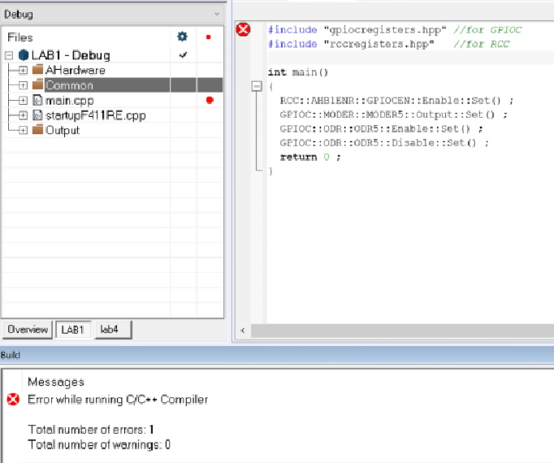

=== *Лабораторная работа №1*

Первым делом был создан файл main.cpp. Далее подключен к проекту файл cstartup.cpp
Созданы папки _AbstractHardware/Registers/FiledValues, Common_. Создана структура проекта в соотвествии со структурой папок

.Структура программы

Настроены STACK, HEAP.

.Установка значений CSTACK, HEAP
image::Photooo/stack and heap.png[]

Далее было скопировано содержимое папки из папки _AHardware/Registers_ и _Common_ с проекта преподавателя в свою папку.
А также написан код программы в main.cpp.

.Код программы
image::Photooo/cod programms.png[]

При первой попытке откомпилировать и отлинковать программу произошла ошибка.

.Первая ошибка

Оказалось, что данная ошибка кроется в названии файла, он был переименован из *startupF411RE* в *startup_STM32F411*.
Вторая попытка компиляции тоже не стала успешной, появилась новая ошибка.

.Вторая ошибка
image::Photooo/Second error.png[]

Чтобы исправить данную ошибку, необходимо было во вкладке *Options->C/C++ Compiler->Preprocessor* сделать некоторые действия с файлами.

.Исправление второй ошибки
image::Photooo/fix second error.png[]
Очередная попытка компиляции не привела к успеху, снова...

.Третья ошибка

Через некторое время я узнал, что программа видит недопустимыми слова _Enable_ и _Disable_. Они были заменены на _High_ и _Low_.
После этого ошибок найдено не было. Для загрузки программы в симуляторе необходимо было его выбрать следующий путь *Options->Debugger->Setup->Driver*
в списке необходимо выбрать *Simulator*. После этого был запущен отладчик и программа. Она работает.

.Работа программы в симмуляторе
image::Photooo/prog work.png[]

Далее был настроен Debugger на отладку через ST-Link. По пути привеленному выше, был выбран *ST-Link*. Плата была подключена к компьютеру
и запущена программа. Программа работает, но никаких видимых действий от платы замечено не было.

.Работа программы с платой

.Микроконтроллер в работе

После этого был запущен анализатор стека. и создан _.map_ файл.

.Анализатор стека
image::Photooo/analys stack.png[]
Данные из .map файла.

.map файл
image::Photooo/Stack usage.png[]

Анализатор стека показывает что рекомендуемый размер 16 байтов.
HEAp это область памяти, где размещаются динамически создаваемые объекты, например, используя оператор new. Так в ладе вы не создавали никаких динамических объектов, то и куча не нужна.
Если установить размер _Stack_ в 0, то программа просто не сможет корректно работать, либо вообще случится её сбой, так как стак содержит необходимые для работы:

- Локальные переменные;
- Адреса возврата из подпрограмм;
- Аргументы функции;
- Временные ячейки памяти, используемые компилятором;
- Контекст прерываний.
